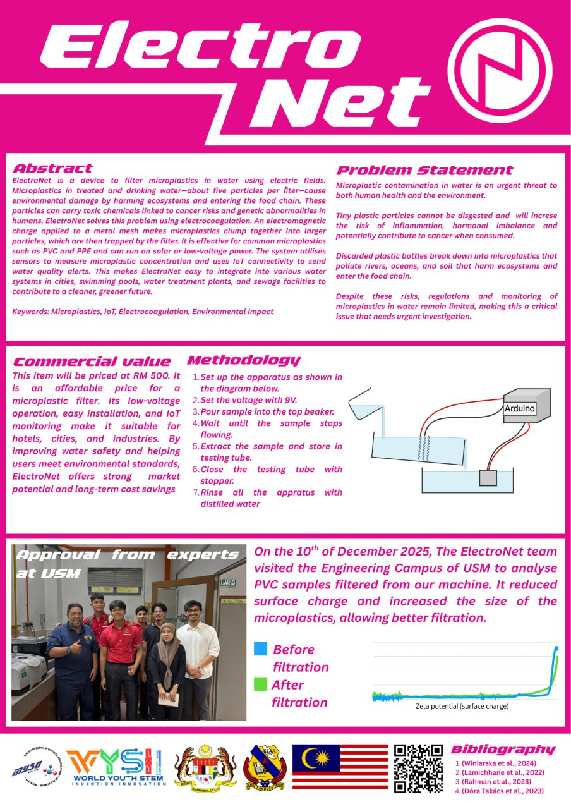

# ElectroNet

> A journey to combat microplastic pollution

This repository documents the development of **ElectroNet**—a microplastic filtration device using electrocoagulation technology—created by three students from **Sekolah Tuanku Abdul Rahman (STAR)**.

## Our Mission

To develop an affordable, effective solution that removes microplastic contamination from water systems, protecting both human health and the environment.

## Project Overview

ElectroNet uses electromagnetic fields to clump microplastics together, making them easier to filter. The system is designed for integration into water treatment plants, swimming pools, and urban water systems.

**Read more:** [Project Details](project.md)

## The Journey

### Lab Testing at USM
On December 10, 2025, our team visited Universiti Sains Malaysia's Engineering Campus to validate our prototype through UV-VIS spectroscopy testing.

- [USM Test Analysis](USM-test-analysis.md)
- [Collaboration Letter](S44-Final-Surat%20kolaborasi%20USM%20-TEAM%202.pdf)
- [Lab Test Data](USM-test/STAR%20UV-VIS/15122025%20PVC%20Water.csv)

### Documentation

#### Photos
**[View Photo Gallery](PHOTOS.md)** - Complete collection with captions

- [Sample Preparation](photos/samples_preparation/)
- [Prototype Development](photos/prototype_preparation/)
- [USM Lab Testing](photos/usm_lab_testing/)

#### Featured

## Contributors

### Students
- **Yusuf Fawwaz bin Fadhlullah** - Team Leader
- **Ahmad Aimal bin Jamalulkhair**
- **Meor Muhammad Ariq bin Meor Zamharil**

### Teacher Advisor
- **Wan Norliza Binti Abdul Raoff**

*From Sekolah Tuanku Abdul Rahman, Ipoh*

## Acknowledgements

We extend our gratitude to **Universiti Sains Malaysia, Kampus Kejuruteraan** for their technical guidance, facilities, and project validation support.

### Project Advisors
- **Dr. Mohamad Danial Shafiq** - Professor, Pusat Pengajian Kejuruteraan Awam
- **Nik Nur Azreen Binti Nik Fauzi** - Master Student
- **Amir Muhammad Noh Amin Bin Abdul Rahman** - PhD Student

*Fakulti Kejuruteraan Bahan & Sumber Mineral, Universiti Sains Malaysia*

---

**Status:** In Development | **Last Updated:** December 2025

